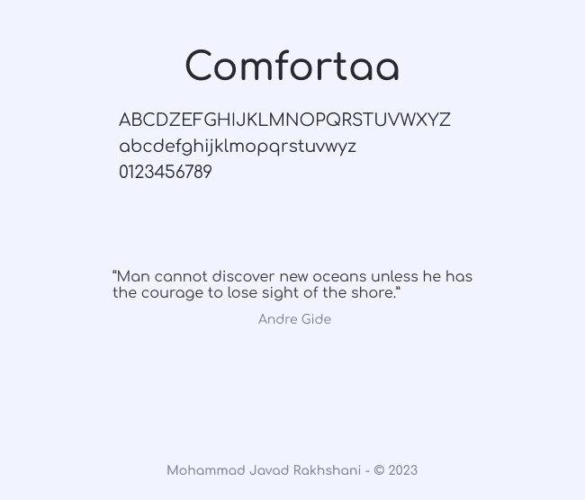

# Introduction to Muses
Muses is a web application to query song lyrics and get them as fast and easy as possible in one place. There is also possible to listen to the song that you queried for in-place.

# Muses (Design Language)
Muses uses a simple and accessible deisgn language that enable users to interact easily with this software. Design proccess mainly focused around accessibilty and familiarity of the design language, so it is expected to users have easy-to-understand learning process when working with Muses.

## Muses (Design Language) - Font

Fonts are everithing in Muses, since all the music lyrics and interface is based-on fonts and texts, the responsibility of choosing one is really diifcult. We use **Comfortaa** font family designed by *Johan Aakerlund*.

> "Comfortaa is a rounded geometric sans-serif type design intended for large sizes. It is absolutely free, both for personal and commercial use."
Says, Johan Aakerlund; we thank him for his goodwill and skill.