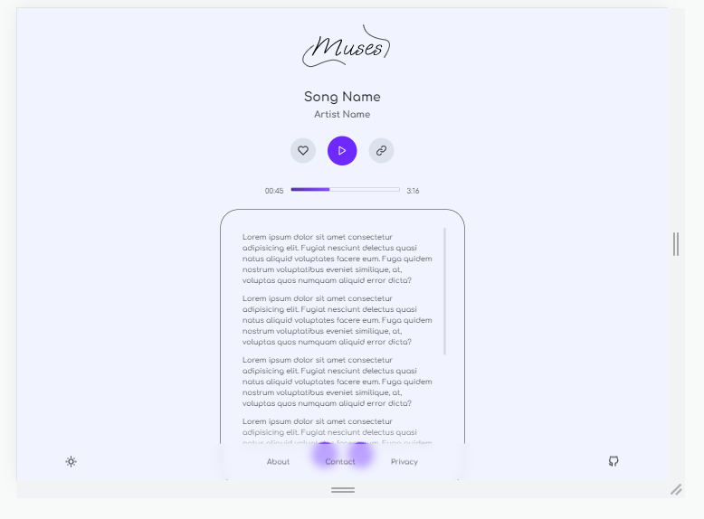

# Introduction to Muses
Muses is a web application to query songs' lyrics and get them as fast and easy as possible in one place. It's possible to listen to the song that you queried for in-place.
 

|  |
|:--:| 
| *Fig 1. Muses's current version homepage.* |
 

|  |
|:--:| 
| *Fig 2. Muses's current version result page.* |
 

# Muses (Design Language)
Muses uses a simple and understandable *design language* that enables users to interact easily with this web application. The design process mainly focused around accessibility and familiarity among artistry, so it is expected that the users will have an easy-to-understand learning process when working with Muses.

## Design Language: Prototypes
As accessibility and familiarity is the highest priority in Muses's Front-End project, the team really focused on how to make this application as easy as it can be and tried to make it more straightforward. 

Here is how the applicaiton's Homepage will look like when a user tries to reach the website: 
|  |
|:--:| 
| *Fig 3. Muses's prototype of Desktop homepage.* |

 

|  |
|:--:| 
| *Fig 4. Muses prototype's of Mobile homepage.* |
 

> "It's as easy as a click!"

 

After the application found your lyric, you can also listen and follow along with the lyrics of your song to have a comfortable experience listening to your favorite song with Muses! After that, you can also copy the lyrics or share the link of the web page to anyone you like!

|  |
|:--:| 
| *Fig 5. Muses's prototype of Desktop, queried the song "Hate the way" by "G-Eazy".* |
 

|  |
|:--:| 
| *Fig 6. Muses's prototype of Mobile, queried the song "Hate the way" by "G-Eazy".* |
 

## Design Language: Font
|  |
|:--:| 
| *Fig 7. Muses uses **"Comfortaa"** font-family.* |
 

Font is everything in Muses, since all the music lyrics and interface is based-on fonts and texts, the responsibility of choosing one is really difficult. We use **Comfortaa** font family designed by *Johan Aakerlund*.

> "Comfortaa is a rounded geometric sans-serif type design intended for large sizes. It is absolutely free, both for personal and commercial use." 

Says, Johan Aakerlund; we thank him for his goodwill and skill.

## Design Language: Textboxes
Textboxes are a way that users send inputs to us and it's the main interface between user thougts and feeling and our software. We design textboxes as simple and accessible as we could: 
|  |
|:--:| 
| *Fig 8. Muses's textboxes.* |
 

## Design Language: Buttons
Buttons contains actions that users want from our application, so they should seem fast and react smooth: 
|  |
|:--:| 
| *Fig 9. Muses's buttons.* |
 

## Design Language: Boxes
It's a lot to talk about in Muses! The design system uses a breakpoiting and responsive design to achive its easy experience and accessibility. We focus on lyric boxes as they are the visible boxes in software and the design and implementation of them is easier to understand. 
|  |
|:--:| 
| *Fig 10. Muses's lyrics boxes.* |
 

# Conclusion
It's all about **simplicity**! The normal box contains nothing but things that a user may search for; when there is a long text and it needs to be consistant on the UI of application, overflowing technique used to make it obvious for users that the text is long; finally, to make things accessibile, some buttons are considered at the bottom of the box for user to make quick actions.