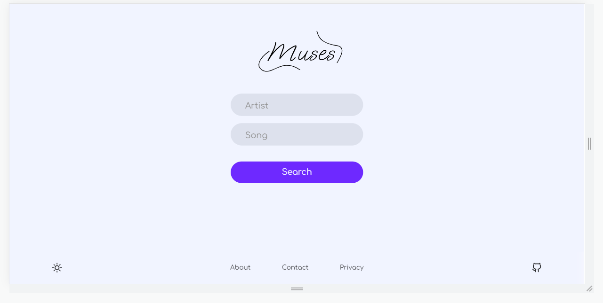
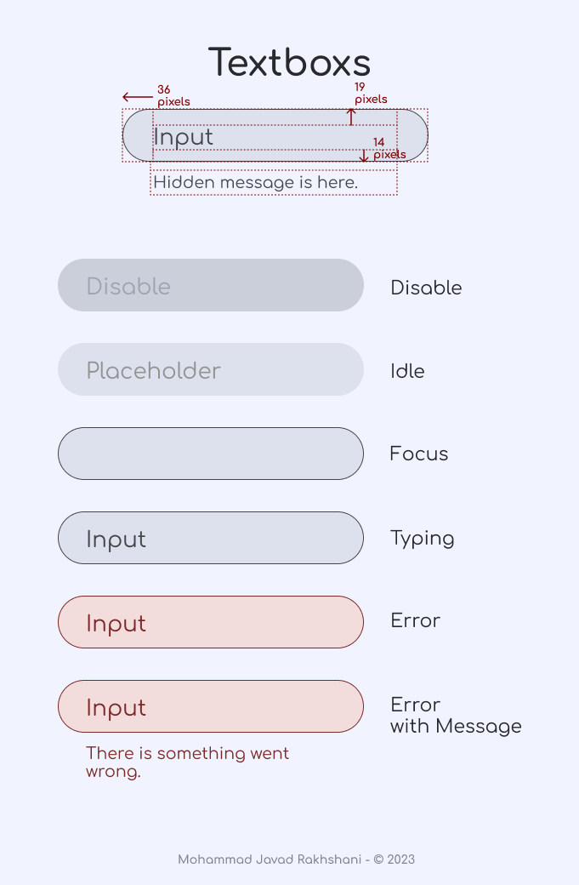
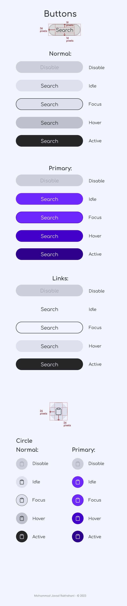

# Introduction to Muses
Muses is a web application to query song lyrics and get them as fast and easy as possible in one place. There is also possible to listen to the song that you queried for in-place.
 

 

*Fig 1. Muses current version homepage.*

 

 

*Fig 2. Muses current version results page.*
# Muses (Design Language)
Muses uses a simple and accessible design language that enables users to interact easily with this software. The design process mainly focused around accessibility and familiarity with the design language, so it is expected that users have an easy-to-understand learning process when working with Muses.

## Introduction to Prototypes
As accessibility and familiarity is the highest priority in Muses project, the team really focused on how to make this application as easy as it can be and tried to make it more straightforward. 
Here is how the applicaiton Homepage will look like when a user tries to enter it: 
### Desktop | Mobile
 
*Fig 3. Muses prototype of Desktop homepage.*
 
*Fig 4. Muses prototype of Mobile homepage.*
 
 
It's just two options to query your favorite song lyric!
 
After the application finds your lyrics, you can also listen and follow along with the lyrics of your song to have a fantastic experience listening to your favorite song with Muses! After that, you can also copy the lyrics or share the link of the web page to anyone you like!

### Desktop | Mobile
 
*Fig 5. Muses prototype of Desktop, queried song "Hate the way" by "G-eazy".*
 
 

*Fig 6. Muses prototype of Mobile, queried song "Hate the way" by "G-eazy".*
 

## Muses (Design Language) - Font
  

*Fig 7. Muses uses **"Comfortaa"** font-family.*
 

Fonts are everithing in Muses, since all the music lyrics and interface is based-on fonts and texts, the responsibility of choosing one is really difficult. We use **Comfortaa** font family designed by *Johan Aakerlund*.

> "Comfortaa is a rounded geometric sans-serif type design intended for large sizes. It is absolutely free, both for personal and commercial use." 

Says, Johan Aakerlund; we thank him for his goodwill and skill.

## Muses (Design Language) - Textboxes
Textboxes are a way that users send inputs to us and it's the main interface between user thougts and feeling and our software. We design textboxes as simple and accessible as we could: 
  

*Fig 8. Muses textboxes.*
 

## Muses (Design Language) - Buttons
As buttons contain actions that users want from our application, they should seem fast and react smooth: 
  

*Fig 9. Muses buttons.*
 

## Muses (Design Language) - Boxes
It's lot to to talk about Boxes in Muses! The design system of Muses uses a breakpoiting and responsive design to achive its easy experience and accessibility. We focus on lyric boxes as they are the visible boxes in software and the design and implementation of them is easier to understand. 
 
*Fig 10. Muses lyrics boxes.*
 

It's all about simplicity! The normal box contains nothing but the only thing the user may search for, when there is long texts and it needs to be consistant in UI of application, overflow used to make it obvious for users that the text is long; finally, to make things accessibile, some buttons are considered for user to make actions.